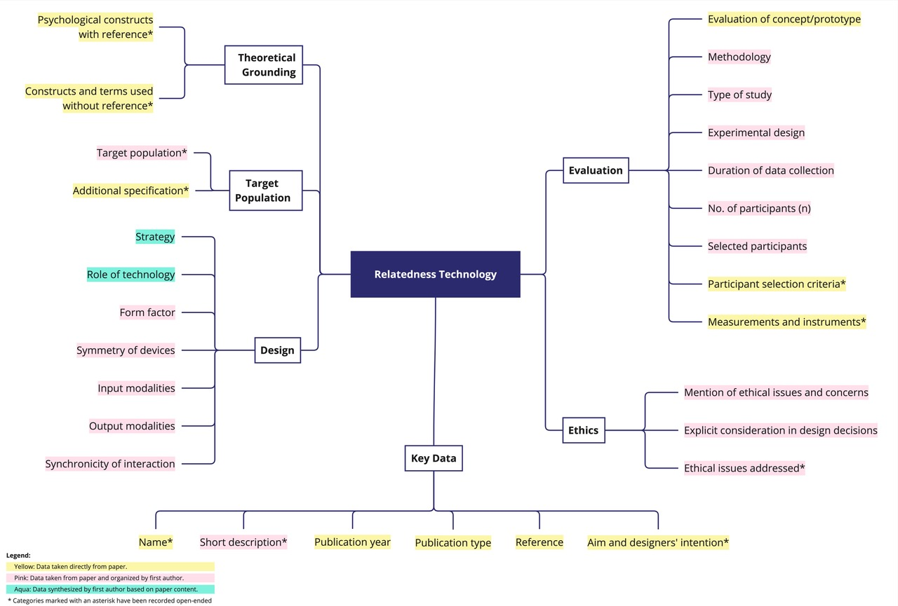

<h2 class="text-2xl font-bold text-pink-600">HOW TO USE CORE?</h2> 

<h3 class="text-m font-semibold mb-2">Explore the Compendium</h3>

Easily browse the full collection of relatedness technologies, filter entries by category, or perform keyword searches to find specific topics of interest.
 

<h3 class="text-m font-semibold mb-2">Discover Patterns and Relationships</h3>

Take advantage of our visualization tools to uncover patterns and relationships within the dataset, helping you navigate relatedness technologies effectively.
 

<h3 class="text-m font-semibold mb-2">Papers and projects that used CORE</h3>

    You can use CORE in your publictions and reference a specific version of it, as the compendium will be updated annually.
    You can locate the version number in our github repository for each branch of CORE.

 

<h3 class="text-m font-semibold mb-2">Offline Access</h3>

Prefer offline access? Download the database and explore independently without requiring web access.
 

<h3 class="text-m font-semibold mb-2">Categories</h3>

Core uses various categories that can be used to compare techbnologie. An overview is given in the following chart.
 

 

<a href="/path/to/download.zip" class="inline-block text-white bg-pink-600 hover:bg-pink-700 font-semibold px-4 py-2 rounded">
    Download the Database
</a> 